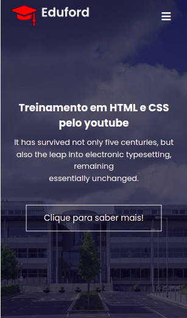
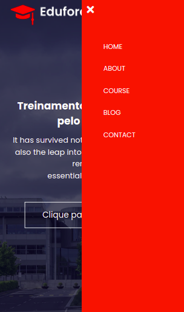
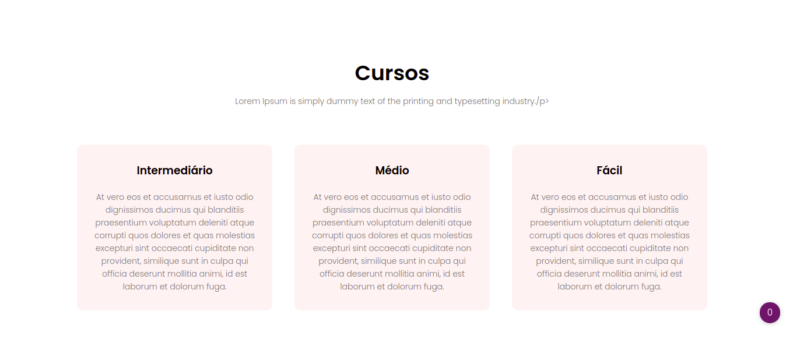
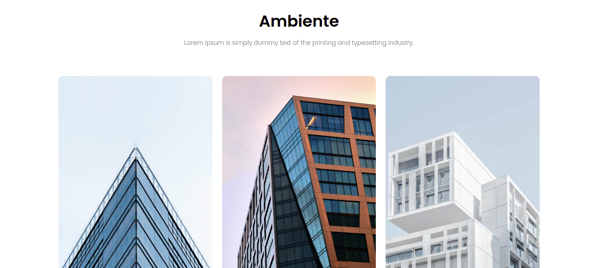
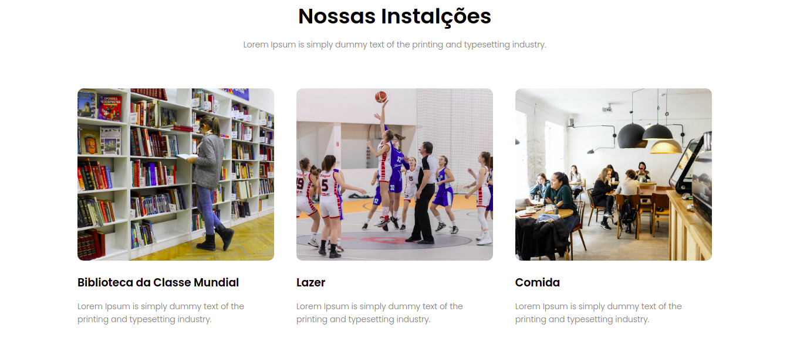

## Projeto criado no canal do youtube Easy Tutorials, retratando um site.

- Tecnologias usadas foram:

   * HTML
   * CSS
   * JAVASCRIPT

# Obs - Todo conteúdo do site foi colocado para demostração.
## Projeto publicado: http://sitetreinamentoyoutube.tfcoder.com/

## <b>Pagina Inicial</b>

## <b>Pagina Inicial Responsiva</b>

## <b>Pagina Incial Responsiva</b>

## <b>Pagina dos Cursos</b>

## <b>Pagina das Cidades</b>

## <b>Pagina das instalações</b>

